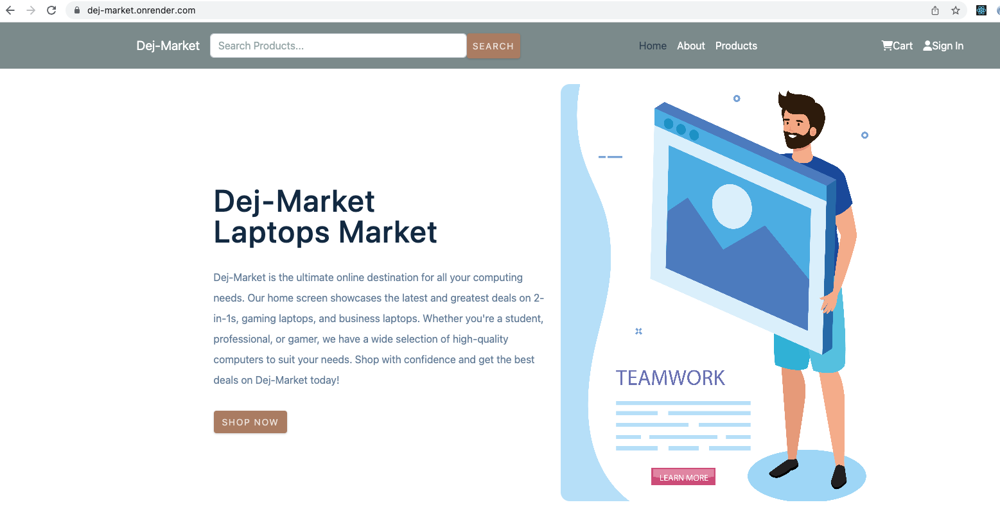

# Dej-Market

[Dej-Market-frontend](https://github.com/DejTes/Dej-Market-frontend)

[Dej-Market-backend](https://github.com/DejTes/Dej-Market-backend)

---
## User Story:
* As a user, i will be able to easily browse and search for products on the Dej-Market application so that i can discover items that might be interested in purchasing.
* As a user, i will be able to add items to the shopping cart so that i can review my selections  before making a purchase.
* As a user, i will be able to purchases through a secure and user-friendly checkout process.

## Live Link

Live demo [here](https://dej-market.onrender.com/)

## Wire frame

 
  ### Built With
 * MongoDb
 * Express
 * React
 * Redux
 * NodeJs
 * React Bootstrap

## Challenges faced
- Learning Redux
- Deployment

